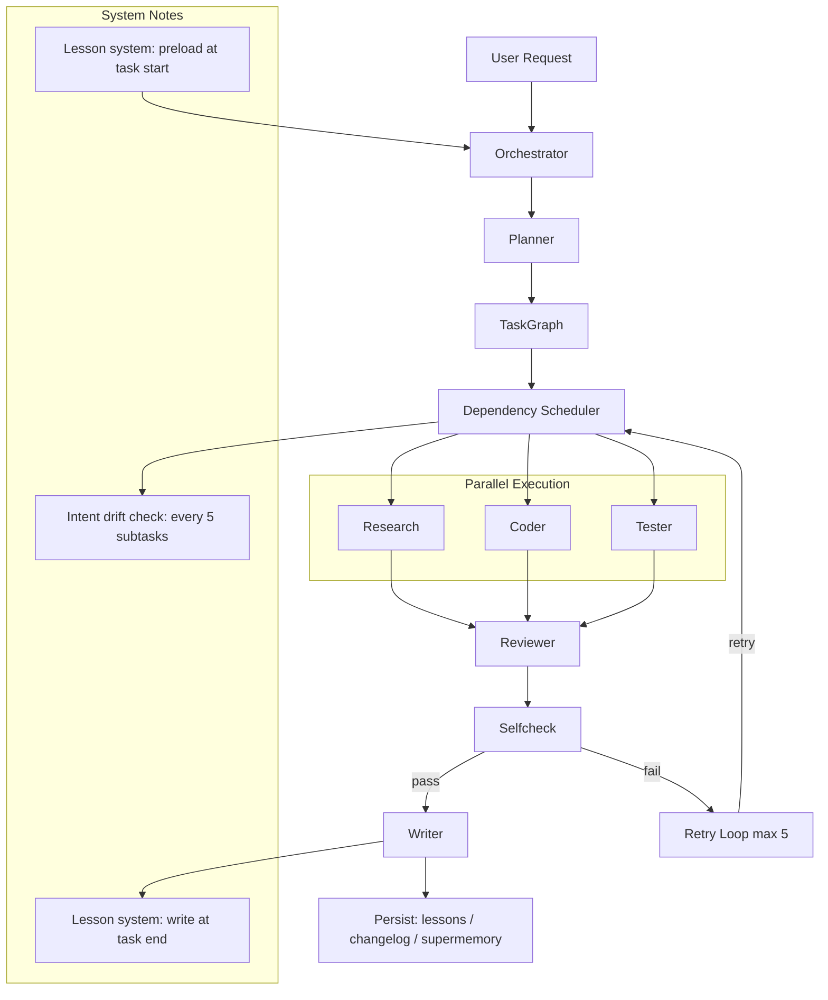

<div align="center">

<p align="center">
  
</p>

<p align="center"><strong>面向真实代码库的多 agent 编程助手。</strong></p>

<p align="center">基于闭环验证、角色分工和多层记忆系统，让 coding agent 更适合真实代码库中的长任务。</p>

<p align="center">
  <a href="./LICENSE"></a>
  
  
</p>

<p align="center"><a href="./README.en.md">English</a> · <a href="./CONTRIBUTING.md">贡献指南</a> · <a href="./LICENSE">License</a></p>

<p align="center">
  
</p>

</div>

## 为什么是 Codemate？

- **不是单 agent 乱跑**：任务会先被 `planner` 拆成 TaskGraph。
- **不是只写代码**：`research / coder / tester / reviewer` 分工协作。
- **不是做完就忘**：`writer` 在尾部收口，写 changelog 并沉淀 lessons。
- **不是无限漂移**：`intent anchor`、`selfcheck`、`retry`、`drift check` 用于保持任务对齐。

## 核心特性

| Feature | What it means |
|---|---|
| TaskGraph execution | `planner` 将任务拆成带依赖的图 |
| Multi-agent roles | `orchestrator / planner / research / coder / tester / reviewer / writer` 角色分工 |
| Closed-loop verification | `selfcheck`、重试回路、drift check 降低任务漂移 |
| Layered context | `supermemory`、`lessons`、`changelog` 各司其职 |
| Persistence finalizer | `writer` 在尾部持久化 changelog 与 lessons |

## 安装与运行

> 需要 Bun `1.3.13`（见根目录 `package.json` 的 `packageManager`）。

```bash
bun install
bun dev
```

可选开发命令（仓库根目录）：

```bash
bun typecheck
bun dev:web
bun dev:desktop
```

## 工作流



## Agent 职责

| Agent | 职责 | 主要输入 | 主要输出 |
|---|---|---|---|
| Orchestrator | 主控与调度 | 用户请求、上下文 | 调度决策 |
| Planner | 任务拆解 | intent anchor、上下文 | TaskGraph |
| Research | 环境/资料调查 | 子任务、上下文 | research drafts |
| Coder | 实现 | TaskGraph 节点 | 代码改动 |
| Tester | 测试与验证 | 需求、实现目标 | 测试结果 |
| Reviewer | 审查与验收 | coder/tester 输出 | review 结果 |
| Writer | 持久化收口 | completed subtasks、diff/fallback、research drafts | changelog / lessons |

## 记忆与持久化

- **supermemory**：本地长期记忆实现，不依赖外部 Supermemory API。
  - 支持 `add/search/list/profile/forget/help`。
  - 显式记忆指令（`remember` / `save this` / `记住`）可在任意 step 写入。
  - memory context 仅在 `step===1` 注入，避免 prompt 持续膨胀。
- **lessons**：可复用工程经验与防错规则。
  - `writer` 只读取 project lessons，不读取 global lessons。
- **changelog**：最近项目历史。
  - 仅用于 historical context，不是 instructions。
  - recent changelog 注入 `orchestrator / planner / coder / tester / reviewer`，不注入 `writer / research`。
- **writer finalizer 规则**：
  - `writer` 是 persistence finalizer，不在普通 TaskGraph 执行队列中。
  - `completedSubtasks > 0` 时不能因 git diff 为空而直接 no-op。

## 测试

```bash
cd packages/codemate
bun typecheck
bun test test/session/prompt.test.ts
bun test test/tool/supermemory.test.ts
```

可选完整测试：

```bash
cd packages/codemate
bun test
```

## 当前状态

- 当前为多 agent 闭环系统，适合真实仓库中的中长任务。
- 仍在持续迭代中，不宣称“完全自主软件工程师”或“绝对正确”。

## 贡献

请先阅读：

- [CONTRIBUTING.zh.md](./CONTRIBUTING.zh.md)
- [CONTRIBUTING.md](./CONTRIBUTING.md)

请勿提交：

- `.codemate` 运行产物
- 临时证书或私钥
- token / API key
- 本机绝对路径信息

## License

[MIT](./LICENSE)
