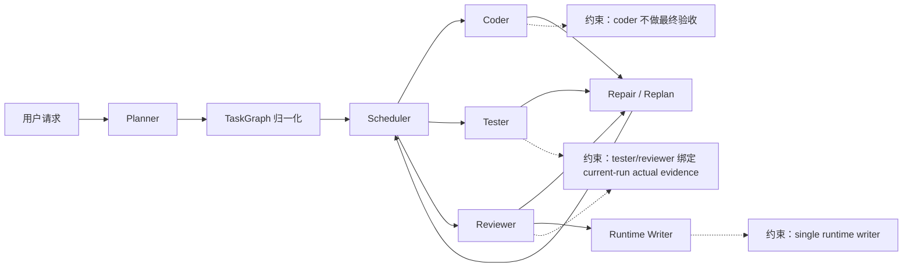
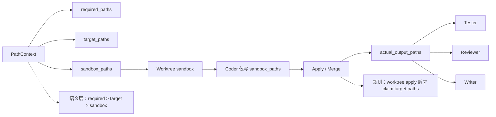
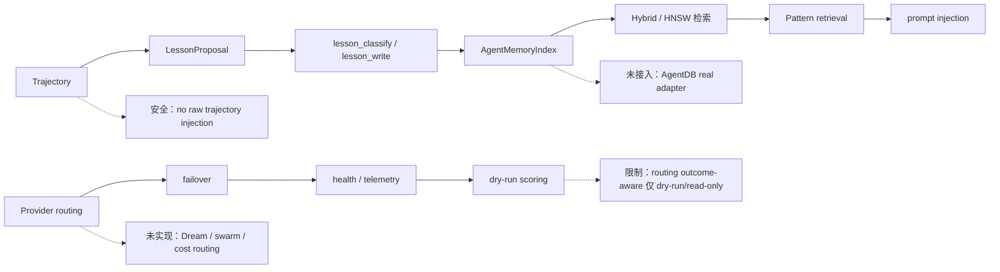

<div align="center">

 ## still in dev, please don't download!!!!
<p align="center">
  
</p>

<p align="center"><strong>A multi-agent coding assistant for real repositories.</strong></p>

<p align="center">Built around closed-loop verification, role specialization, and layered memory for long-running engineering tasks.</p>

<p align="center">
  <a href="./LICENSE"></a>
  
  
</p>

<p align="center"><a href="./README.en.md">简体中文</a> | <a href="./docs/codemate-self-study-architecture.md">Self-study architecture</a> | <a href="./CONTRIBUTING.md">Contributing</a> | <a href="./LICENSE">License</a></p>
<p align="center"><sub>Special thanks to opencode — Codemate is developed on top of it.</sub></p>

<p align="center">
  
</p>

</div>

## Why Codemate?

- **Not a single-agent free run**: work is decomposed into a TaskGraph by `planner`.
- **Not just code generation**: `research / coder / tester / reviewer` collaborate by role.
- **Not done-and-forgotten**: `writer` closes the loop with changelog + lessons.
- **Not drift-prone**: `intent anchor`, `selfcheck`, `retry`, and `drift check` keep execution aligned.

## Install & Run

### Install CLI From npm

> Requires Bun `1.3.13` or newer in `PATH` to run `codemate` (installation via npm still uses Node/npm).

```bash
npm install -g @codemate-ai/cli
codemate --version
codemate
```

### Run From Source (Development)

> Repository development also requires Bun `1.3.13` (see `packageManager` in root `package.json`).

```bash
bun install
bun dev
```

Optional commands (repo root):

```bash
bun typecheck
bun dev:web
bun dev:desktop
```

## Core Capabilities


## Agent Roles

| Agent | Responsibility | Main inputs | Main outputs |
|---|---|---|---|
| Orchestrator | Control and scheduling | User request, context | Scheduling decisions |
| Planner | Task decomposition | Intent anchor, context | TaskGraph |
| Research | Research and evidence | Subtask, context | Research drafts |
| Coder | Implementation | TaskGraph node | Code changes |
| Tester | Validation and tests | Requirements, target implementation | Test results |
| Reviewer | Review and acceptance | Coder/tester outputs | Review result |
| Writer | Persistence finalization | Completed subtasks, diff/fallback, research drafts | Changelog / lessons |

## Memory & Persistence

- **supermemory**: local long-term memory, no external Supermemory API dependency.
  - Supports `add/search/list/profile/forget/help`.
  - Explicit memory instructions (`remember` / `save this`) can be saved at any step.
  - Memory context is injected only at `step===1` to avoid prompt bloat.
- **lessons**: reusable engineering learnings and guardrails.
  - `writer` reads only project lessons, not global lessons.
- **changelog**: recent project history.
  - Historical context only, not instructions.
  - Recent changelog is injected into `orchestrator / planner / coder / tester / reviewer`, not into `writer / research`.
- **writer finalizer rules**:
  - `writer` is a persistence finalizer, not a normal TaskGraph execution node.
  - If `completedSubtasks > 0`, writer must not no-op just because git diff is empty.

## 架构图 A：TaskGraph 执行闭环



## 架构图 B：Worktree / Path / Tool Guardrails



## 架构图 C：Self-study / Provider / Memory



## Testing

```bash
cd packages/codemate
bun typecheck
bun test test/session/prompt.test.ts
bun test test/tool/supermemory.test.ts
```

Optional full run:

```bash
cd packages/codemate
bun test
```

## Current Status

- Codemate is a multi-agent closed-loop system for real repository work.
- The project is actively evolving and does not claim full autonomy or perfect correctness.

## Contributing

Read first:

- [CONTRIBUTING.md](./CONTRIBUTING.md)
- [CONTRIBUTING.zh.md](./CONTRIBUTING.zh.md)

Do not commit:

- `.codemate` runtime artifacts
- temporary certificates or private keys
- token / API key
- local machine-specific absolute paths

## License

[MIT](./LICENSE)
