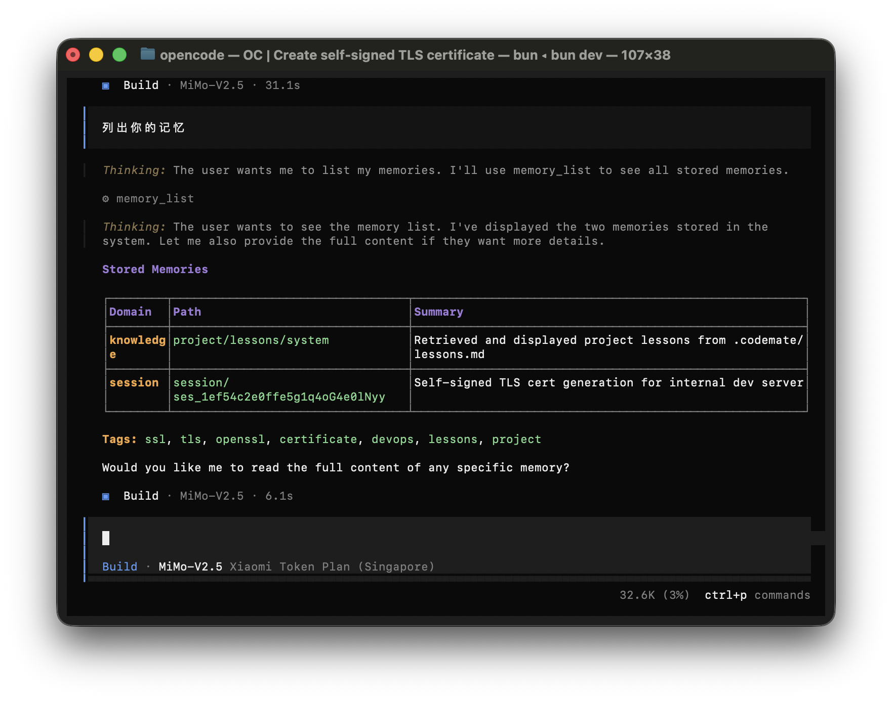

<p align="center">
  
</p>

<div align="center">

### 面向长周期工程的开源编程代理

**记忆优先。学习增强。验证驱动。研究原生。**

[](https://github.com/Wholiver/codemate/actions/workflows/publish.yml)
[](https://jsr.io/@codemate/codemate)

_基于 OPENCODE 构建，向 OPENCODE 团队与社区致以诚挚感谢。_

<sub><a href="README.md">English</a> · <a href="README.zh.md">简体中文</a></sub>

</div>

[](https://codemate.ai)

---

<p align="center"><strong>快速浏览：</strong> <a href="#30-秒价值">30 秒价值</a> · <a href="#install-global-cli">安装</a> · <a href="#架构总览">架构</a> · <a href="#核心能力">核心能力</a> · <a href="#对比">对比</a></p>

## 30 秒价值

Codemate 面向的是需要在多轮会话中持续产出稳定结果的团队，而不仅仅是一次会话里的“聪明回答”。

| 支柱         | 内置能力                                      | 在实际工作中的变化                       |
| ------------ | --------------------------------------------- | ---------------------------------------- |
| 记忆         | 持久化记忆与结构化检索                        | 决策、模式和修复可跨会话延续             |
| 经验         | `.codemate/lessons.md` + `lesson_write` 回路 | 错误沉淀为可复用的团队知识               |
| 自检         | `selfcheck`（默认检查 + 自定义检查）         | 降低“看起来完成了”但实际上失败的情况     |
| 深度研究     | `research-*` + `websearch` + `webfetch`      | 在不确定场景下做出更可靠决策             |
| 统一运行时   | MCP + LSP + ACP 一体化                        | 终端与自动化流程中的行为一致             |

<a id="install-global-cli"></a>

## 安装（全局 CLI）

> [!IMPORTANT]
> 参与仓库开发请使用 Bun `1.3.13`（本 monorepo 依赖精确版本）。

```bash
npm install -g codemate-agent
codemate --help
```

- 全局 `codemate` 命令包：https://www.npmjs.com/package/codemate-agent
- 文档：https://codemate.ai/docs

## SDK（可选，JSR）

```bash
npx jsr add @codemate/codemate
```

- SDK 包地址：https://jsr.io/@codemate/codemate

## CLI 测试运行（仓库方式）

```bash
git clone https://github.com/Wholiver/codemate.git
cd codemate
bun install
bun dev
```

## 架构总览

> [!IMPORTANT]
> 默认分支是 `dev`（不是 `main`）。做 diff 和 PR 目标分支时请使用 `dev` / `origin/dev`。

```text
Codemate Runtime
├─ 1. 输入层
│  ├─ 用户请求
│  ├─ 项目上下文（仓库/文件/运行状态）
│  └─ 会话历史
├─ 2. 规划层
│  ├─ 目标拆解
│  ├─ 约束检测
│  └─ 执行策略选择
├─ 3. 知识层
│  ├─ Memory 系统
│  │  ├─ 写入：memory_create
│  │  ├─ 检索：memory_search / memory_read / memory_list
│  │  └─ 检索模式：keyword / semantic / hybrid
│  └─ Lessons 系统
│     ├─ 存储：.codemate/lessons.md
│     ├─ 写入：lesson_write
│     └─ 加载：<project-lessons>
├─ 4. 研究层
│  ├─ research
│  ├─ research-add-items
│  ├─ research-add-fields
│  ├─ research-deep
│  └─ research-report（配合 websearch / webfetch）
├─ 5. 执行层
│  ├─ 代码修改
│  ├─ Shell 命令
│  └─ 工具 / MCP 调用
├─ 6. 验证层
│  ├─ selfcheck
│  ├─ 默认检查：typecheck / lint / test
│  └─ 自定义检查：pytest / go test / cargo test ...
└─ 7. 反馈闭环
   ├─ 记录失败与修复
   ├─ 更新 lessons 和 memory
   └─ 提升下一轮质量
```

Codemate 被设计为可复利的闭环：每一次运行都可以提升下一次运行质量。

## 核心能力

### 1) Memory：超长项目记忆

把关键项目上下文跨会话保留下来。

- 适用场景：任务跨天或跨周，且决策需要保持一致。
- 例子：团队约定“本地用 SQLite、云端用 Postgres”。一周后做迁移时，仍会沿用这条规则，避免方案跑偏。
- 价值：减少重复说明，也减少因遗忘上下文造成的回归问题。

### 2) Lessons：内置自学习

把失败与修复沉淀成可复用的团队经验。

- 适用场景：希望同类问题不要反复出现。
- 例子：一次发布因环境变量缺失失败，下一次发布流程会先补上环境变量预检清单。
- 价值：学习会在项目层面持续累积，而不是每轮会话都重来。

### 3) Self-check：交付前验证

交付前先验证，失败就修复并复检，直到稳定。

- 适用场景：改动影响关键路径或质量要求较高。
- 例子：重构后先跑 typecheck、lint、test；若 lint 失败，先修复再复跑，再反馈完成。
- 价值：显著减少“看起来完成了，但 CI 会挂”的情况。

### 4) 深度研究：研究原生工作流

在高不确定问题上，用结构化方式做调研和取舍。

- 适用场景：需求模糊，或外部 API/规则变化快。
- 例子：在两个 API 供应商间选型时，对比价格、限流、迁移成本和风险，并输出决策简报。
- 价值：在迁移、供应商选型等场景做出更稳的决策。

## 对比

| 维度         | 与 OPENCODE 对比                                                     | 与 Claude Code 对比                             |
| ------------ | -------------------------------------------------------------------- | ----------------------------------------------- |
| 运行时形态   | 活跃运行时整合在 `packages/codemate/src/*`，子系统深度集成          | 运行时全开源，可端到端审查与修改                |
| 记忆模型     | 内置持久化记忆 + 检索 + 生命周期                                     | 跨会话项目连续性更强                            |
| 学习闭环     | 原生 lessons 工作流（`.codemate/lessons.md` + `lesson_write`）      | 在日常工程中具备更明确的组织化学习路径          |
| 验证能力     | 一等公民的自检工具与结构化失败闭环                                   | 最终输出前的验证路径更可控                      |
| 研究深度     | 专用研究工具链（`research-*`、`websearch`、`webfetch`）             | 更适合高不确定性的工程决策                      |
| 模型策略     | 设计上与模型提供方解耦                                               | 不绑定单一供应商路线                            |

## 贡献

> [!IMPORTANT]
> 推送前请在各 package 目录执行检查（不要在仓库根目录跑测试）。

发起 PR 前请阅读 [CONTRIBUTING.md](./CONTRIBUTING.md)。

---

**社区**：[Discord](https://discord.gg/codemate) · [X](https://x.com/codemate)
