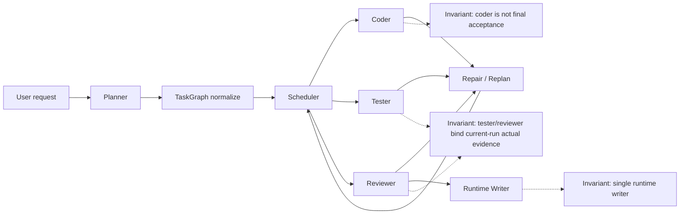
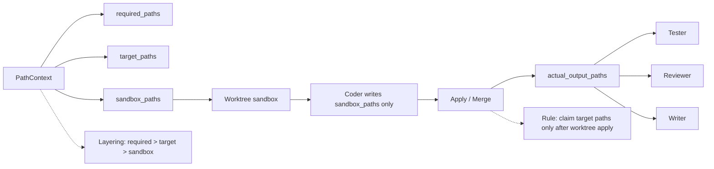
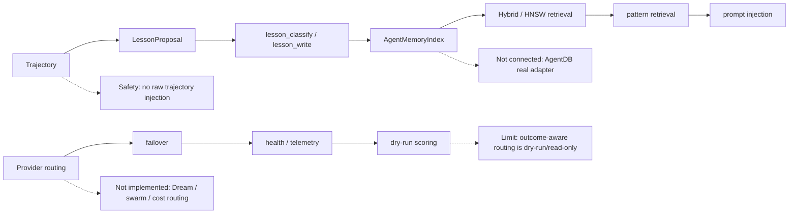

# Codemate Ruflo-aligned Architecture (Current Snapshot)

## 1. Overview

Codemate does not copy Ruflo implementation directly. It adopts Ruflo's closed-loop ideas and maps them to a coding-agent runtime:

- RETRIEVE: Pattern-first retrieval from lessons and optional memory index.
- JUDGE: tester/reviewer/selfcheck quality signals, lesson quality gate, role boundary guards.
- DISTILL: TrajectoryRecord and failure-recovery evidence distilled into LessonProposal.
- CONSOLIDATE: LessonRecord v2 pipeline, dedupe/conflict/quarantine, project/global safety filters.
- ROUTE: TaskGraph runtime role routing + provider route decision/fallback + telemetry persistence and dry-run recommendation metadata.

Scope note:

- Dream/background consolidation is intentionally not implemented.

## 2A. Architecture: TaskGraph closed loop



## 2B. Architecture: Worktree / Path / Tool guardrails



## 2C. Architecture: Self-study / Provider / Memory



## 3. TaskGraph runtime

- Planner generates TaskGraph JSON nodes.
- `parseTaskGraph` validates JSON shape and performs deterministic repair for malformed `blockedBy/tags` output.
- `normalizeTaskGraph` repairs role/schema/dependency issues and enforces runtime invariants.
- Work package collapse merges linear operation-step coder chains into coder work packages when they are same artifact family and low parallel value.
- `blockedBy` is preserved as execution dependency truth.
- `parallel` tag is advisory only and never overrides non-empty `blockedBy`.
- Runtime order remains coder/research -> tester -> reviewer -> writer finalizer.
- Writer finalizer waits for required non-writer tasks completion in active run.
- Run isolation keys: `run_id`, `intent_anchor_hash`, `source_user_message_id`.
- Legacy/foreign tasks are dropped or adopted safely under run-identity rules.
- Cancel/interrupt path isolates active run state and avoids cross-run completion leakage.

## 4. Role capability boundary

- Capability matrix exists by role (`orchestrator/planner/research/coder/tester/reviewer/writer/selfcheck`).
- Coder boundary:
- Coder can implement, edit, and report local sanity evidence only.
- Coder cannot be final verifier or acceptance authority.
- Tester boundary:
- Tester owns final verification and pass/fail signals.
- Reviewer boundary:
- Reviewer owns acceptance review and reviewer approval signal.
- Writer boundary:
- Writer owns persistence path (changelog/lesson tools), not implementation.
- Tool denylist is enforced by role permission sets and child-session permission merge.
- Quality signal whitelist is enforced so disallowed role signals are dropped.
- Drift guard reserves drift authority to orchestrator/selfcheck and avoids verification-artifact false positives.

## 5. Trajectory-first self-study

- Runtime emits `TrajectoryRecord` for task execution evidence.
- Project persistence uses `.codemate/trajectories.jsonl` (compact JSONL records).
- Redaction filters private key blocks, certificate PEM bodies, tokens/secrets, oversized or unsafe fields.
- Writer Evidence Guard requires "Execution evidence from this run" preference over stale workspace inference.
- Trajectory-derived `LessonProposal` is produced from failure/recovery and verified workflow evidence.
- Proposal is never written directly as lesson.
- Proposal must still pass `lesson_classify -> classification_id -> lesson_write`.

## 6. Lessons v2 pipeline

- Canonical schema: `LessonRecord v2`.
- Supports v1/v2 parse/migration compatibility in read paths.
- Strong binding: `lesson_classify` produces `classification_id`, `lesson_write` requires it.
- Quality gate validates confidence/evidence/source quality.
- Changelog-fact-only entries are filtered from durable lessons.
- Dedupe avoids duplicate durable lesson entries.
- Conflict detection can quarantine conflicting lessons.
- Injection defaults to active lessons only.
- `quarantined/deprecated` are not prompt-injected by default.
- Writer project rule: writer persistence path is project-scoped by default and follows scope safety controls.

## 7. Pattern retrieval / AgentMemoryIndex

- `PatternRecord` is compact retrieval unit for prompt injection.
- Pattern scoring combines scope/tag/summary/applies overlap, kind priority, confidence, and recency.
- Active-only retrieval by default.
- Global confidence threshold default: global `< 0.8` filtered.
- Writer retrieval is project-only.
- `AgentMemoryRecord` unifies lesson/trajectory/failure-recovery memory shape.
- `AgentMemoryIndex` interface: `upsert/search/delete/stats/list`.
- Backends:
- `InMemoryAgentMemoryIndex`
- `JsonlAgentMemoryIndex`
- `HybridAgentMemoryIndex` (keyword + brute-force cosine)
- `HnswAgentMemoryIndex` real backend path (ANN search + persistence/rebuild + safe fallback), covered by real-backend tests.
- `syncProjectMemorySources` syncs lessons/trajectories into memory index.
- Backend selection/config supports off/jsonl/memory/hybrid/hnsw plus agentdb mode flags (agentdb currently fallback).
- No raw trajectory prompt injection. Only reusable pattern-formatted memory is injected.

## 8. Provider routing

- `ProviderRoutingConfig` controls routing/fallback behavior.
- `resolveProviderRoute` computes selected provider/model + fallback chain + warnings.
- Fallback chain merges route-level and global fallback with dedupe.
- Runtime failover only applies when routing is enabled.
- Retryable errors can trigger fallback attempts.
- Non-retryable errors do not trigger fallback chain continuation.
- `provider_route_decision` metadata is attached to runtime context, not prompt text.
- Route attempt metadata records provider/model/success/error category/latency/fallback index.
- Provider telemetry persistence supports memory/jsonl store; project JSONL path: `.codemate/provider-telemetry.jsonl`.
- Outcome-aware recommendation/scoring exists in read-only mode (`off`/`dry_run`); no automatic provider switch.
- Default behavior is unchanged when routing is disabled.

## 9. Adaptive replanning

- `ReplanProposal` captures local failure-driven replan suggestion.
- `deriveReplanProposalFromFailure` infers preserve/retry/replace/add task actions.
- `TaskGraphPatch` schema + derive/validate/apply path is implemented for safe localized graph mutation.
- Runtime automatic patch application is gated by `experimental.adaptive_replan.enabled`.
- Default remains disabled (`enabled: false`), so baseline runtime behavior is unchanged unless explicitly enabled.
- Invalid/unsafe patch falls back to legacy retry/replan prompt path.
- Transient provider/model errors do not generate replan proposal.

## 10. Ruflo comparison

| Ruflo concept | Codemate implementation | Status |
|---|---|---|
| RETRIEVE | Pattern-first retrieval + optional AgentMemoryIndex source + lessons fallback | Implemented |
| JUDGE | tester/reviewer/selfcheck signals, quality gate, role boundary checks | Implemented |
| DISTILL | Trajectory -> LessonProposal + failure-recovery derivation | Implemented |
| CONSOLIDATE | Lesson v2 pipeline, dedupe/conflict/quarantine/active injection | Implemented |
| ROUTE | TaskGraph role routing + provider route decision/fallback (opt-in) | Implemented (minimal) |
| AgentDB/HNSW | Real HNSW backend path + persistence/rebuild; AgentDB real adapter not connected | Partial |
| Trajectory learning | Trajectory persistence + proposal distillation + retrieval feed path | Implemented (non-background) |
| ProviderManager/fallback | Config resolver + runtime failover + telemetry JSONL + dry-run recommendation | Implemented (minimal) |
| Background workers / Dream | Not implemented by design | Intentionally not implemented |
| Swarm/federation | Not a Codemate goal | Intentionally not implemented |
| Adaptive replanning | ReplanProposal + TaskGraphPatch derive/validate/apply path, default disabled | Implemented (guarded) |

Explicitly not implemented:

- Dream/background consolidation: intentionally not implemented.
- Swarm/federation: not a Codemate goal.
- AgentDB real adapter: not implemented.
- Outcome-aware provider auto-switch: not implemented (dry-run/read-only only).

## 11. Safety invariants

- Coder cannot produce `tester_passed/reviewer_approved/selfcheck_passed` quality signals.
- Final verification cannot be owned by coder role.
- Writer must prefer "execution evidence from this run".
- Injection is active-only by default.
- Low-confidence global memory/patterns are not injected.
- Writer retrieval is project-only.
- Provider routing disabled means no runtime behavior change.
- HNSW unavailable fallback must not throw.
- Replan proposal is not a lesson and cannot bypass lesson pipeline.
- `parallel` tag never overrides `blockedBy`.
- Outcome recommendation metadata must not mutate selected provider in dry-run mode.

## 12. Typecheck baseline

- Repository-wide `bun typecheck` is currently failing (baseline debt outside this feature set).
- This round's core files for memory/HNSW/adaptive/provider are type-clean in baseline scan.
- Baseline report: `docs/typecheck-baseline.md`.

## 13. Test map

- `test/session/prompt.test.ts`
- `test/session/trajectory.test.ts`
- `test/session/trajectory-persistence.test.ts`
- `test/session/lesson-schema.test.ts`
- `test/tool/lesson-write.test.ts`
- `test/session/pattern-retrieval.test.ts`
- `test/session/agent-memory-index.test.ts`
- `test/session/agent-memory-hnsw-index.test.ts`
- `test/session/agent-memory-hnsw-real.test.ts`
- `test/session/embedding.test.ts`
- `test/provider/provider-routing.test.ts`
- `test/provider/provider-telemetry.test.ts`
- `test/provider/provider-telemetry-jsonl.test.ts`
- `test/provider/provider-route-scoring.test.ts`
- `test/provider/provider-route-dry-run.test.ts`
- `test/session/llm.test.ts`
- `test/session/replan.test.ts`
- `test/session/taskgraph-patch.test.ts`
- `test/tool/task.test.ts`
- `test/agent/agent.test.ts`
- `docs/typecheck-baseline.md`

## 14. Non-goals

- Dream / background consolidation
- Swarm/federation
- Automatic full GOAP graph mutation
- Hidden raw trajectory prompt injection
- Default semantic/hybrid memory behavior
- Default provider routing behavior changes

## 15. Commands

```bash
cd packages/codemate
bun typecheck
bun test test/session/replan.test.ts
bun test test/provider/provider-routing.test.ts
bun test test/session/llm.test.ts
bun test test/session/pattern-retrieval.test.ts
bun test test/session/agent-memory-index.test.ts
bun test test/session/agent-memory-hnsw-index.test.ts
bun test test/session/agent-memory-hnsw-real.test.ts
bun test test/session/taskgraph-patch.test.ts
bun test test/provider/provider-telemetry-jsonl.test.ts
bun test test/provider/provider-route-scoring.test.ts
bun test test/provider/provider-route-dry-run.test.ts
bun test test/session/trajectory.test.ts
bun test test/session/trajectory-persistence.test.ts
bun test test/tool/lesson-write.test.ts
bun test test/tool/task.test.ts
bun test test/agent/agent.test.ts
```
